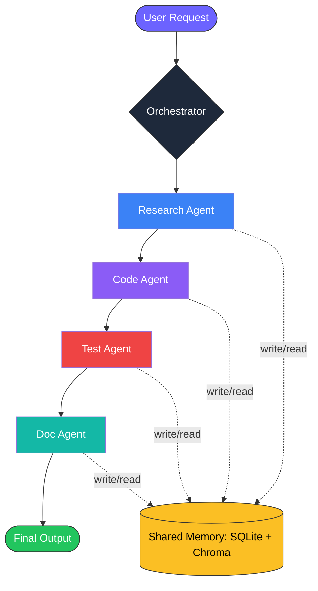
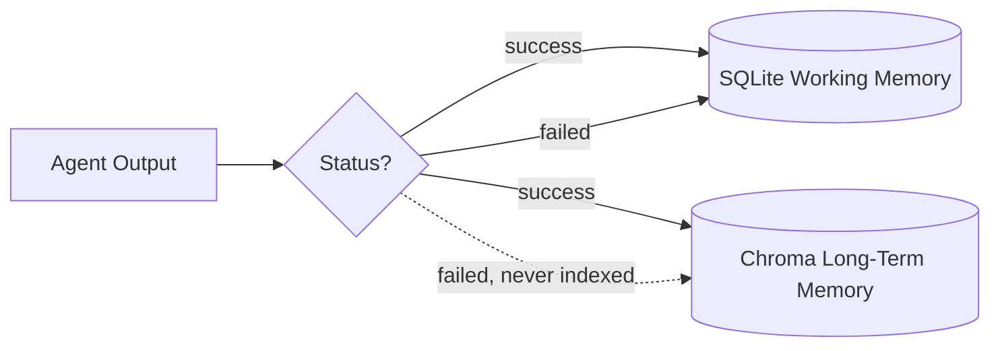

<div align="center">

# ✨ VibeOps

# LIVE DEMO 🔗: https://vibeops-snehasharmaa.streamlit.app/

### Multi-Agent AI Engineering Workspace

*Specialized AI agents collaborate under one orchestrator with shared memory — research, code, test, and document, all in one run.*

<br>

[


](.github/workflows/ci.yml)
[


](https://www.python.org/)
[


](tests/)
[


](https://github.com/langchain-ai/langgraph)
[


](#)

<br>

</div>

---

## 🚀 What is VibeOps?

> No more copy-pasting between AI chat tabs for research, then coding, then testing, then docs.
> **One request in → working code + tests + documentation out.**

A central **Orchestrator** delegates a task to three specialist agents — 🔍 **Research**, 💻 **Coder**, and 🧪 **Tester/Docs** — who share memory and hand work back and forth until the task is complete.



---

## 🏗️ Architecture

### 1️⃣ Orchestrator — `src/orchestrator.py`
A **fixed state machine** built with LangGraph, not a free-roaming planner LLM. Each node is a specialist agent; edges define allowed transitions.

| Approach | ✅ Pro | ⚠️ Con |
|---|---|---|
| **Fixed state machine** *(chosen)* | Predictable, easy to debug, bounded cost | Less flexible to novel tasks |
| Dynamic LLM planner | Handles arbitrary workflows | Can loop, is expensive, hard to test |

An explicit `max_steps` guard means the pipeline can never loop forever, and every transition is logged.

### 2️⃣ Shared Memory — `src/memory.py`



| Layer | Storage | Purpose |
|---|---|---|
| 🗃️ **Working memory** | SQLite | Structured task state — which agent ran, what it returned, status, timestamps. Drives control flow. |
| 🧭 **Long-term memory** | Chroma (vector store) | Free-text semantic recall — *"have we solved something like this before?"* Additive context only, never control flow. |

Long-term memory uses a small, dependency-free hashing-based embedding function instead of Chroma's default (which downloads a ~90MB model from S3 and fails on network-restricted machines). This keeps the whole project runnable **fully offline** once installed.

### 3️⃣ Agents — `src/agents/`
Each agent is a thin wrapper: a system prompt + a single `run(task, context)` method that calls the Claude API and returns a structured result. Agents never call each other directly — they only read/write shared memory and return to the orchestrator, keeping them independently testable and swappable.

### 4️⃣ Message Schema — `src/schema.py`
All inter-agent communication uses one Pydantic model so logging, memory writes, and testing stay uniform across every agent:

```python
AgentMessage(task_id, role, input, context, output, status, timestamp)
```

---

## 🛡️ Failure Handling

| 🔧 Mechanism | Behavior |
|---|---|
| ♻️ **Retry** | Every agent call retries twice with exponential backoff |
| 🧯 **Graceful degrade** | If all retries fail, orchestrator marks task `failed`, logs it, returns a **partial result** instead of crashing |
| 🔒 **Loop guard** | `max_steps = 10` prevents infinite loops from routing bugs |

---

## ⚙️ Setup (100% free to run)

```bash
python -m venv venv
source venv/bin/activate       # Windows: venv\Scripts\activate
pip install -r requirements.txt
cp .env.example .env           # add your ANTHROPIC_API_KEY
python -m src.main "Build a Python function that validates email addresses"
```

> 💡 No paid infra required — SQLite and Chroma both run locally with zero setup. Anthropic's API offers free trial credits.

### 🎨 Run the Streamlit demo
```bash
streamlit run app.py
```

### ✅ Run tests
```bash
pytest tests/ -v
```

<div align="center">

**8/8 tests passing** — all use a mocked LLM client, so they run **offline with zero API cost** and are fully deterministic ✅

</div>

---

## 🧰 Tech Stack

<div align="center">


</div>

| Layer | Tool |
|---|---|
| Orchestration | LangGraph (fixed state machine) |
| LLM | Claude API (Anthropic) |
| Structured memory | SQLite |
| Semantic memory | Chroma (offline embedding) |
| Schema / validation | Pydantic |
| Demo UI | Streamlit |
| Testing | pytest + mocked API client |
| CI | GitHub Actions |

---

<div align="center">

### 👩‍💻 Built by **Sneha Sharma**
✉️ sharmasnehaa08@gmail.com

</div>
